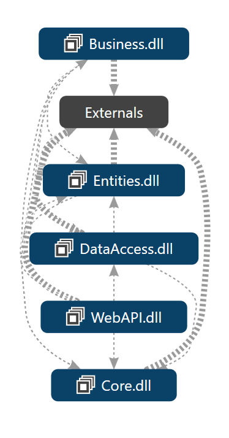

# Base Architecture

**BaseArchitecture** is a modular and scalable architecture built using .NET technologies. It is designed to serve as a starting point for enterprise-level applications, providing a clean and layered project structure that follows modern software development best practices.

## 🧱 Project Structure

The solution is composed of five main projects, each with a distinct responsibility:

### 1. `Core`

Contains shared components and infrastructure logic that are used throughout the application.

- `Aspects`: Cross-cutting concerns (e.g., logging, caching, validation).
- `CrossCuttingConcerns`: Utilities like logging, caching, exception handling.
- `DataAccess`: Generic repository interfaces and helpers.
- `DependencyResolvers`: Dependency Injection containers and modules.
- `Entities`: Common entity definitions.
- `Extensions`, `Middlewares`, `Utilities`: Utility classes, middleware components, and extension methods.
- `configurationSettings.json`: Custom app configuration file.

### 2. `Business`

Holds the business logic and validation rules.

- `Abstract`: Interfaces for business services.
- `Concrete`: Implementations of business services.
- `BusinessAspects`: Business-level AOP concerns.
- `Constants`: Application constants.
- `DependencyResolvers`: Business-specific DI modules.
- `ValidationRules`: Business rule validation logic using FluentValidation or similar.

### 3. `DataAccess`

Responsible for communicating with the database.

- `Abstract`: Interfaces for repository classes.
- `Concrete`: Repository implementations.
- `EntityFramework`: EF Core configurations and context.
- `Migrations`: EF Core migrations.
- `Dependencies`: DataAccess-specific DI modules.

### 4. `Entities`

Contains the data models used throughout the application.

- `Dtos`: Data Transfer Objects.
- `Dependencies`: DI configuration for model bindings.

### 5. `WebAPI`

The API layer that exposes business functionality to the outside world.

- `Controllers`: RESTful API endpoints.
- `Connected Services`: Third-party service integrations.
- `Properties`: Assembly info and config.
- `Dependencies`: WebAPI-specific DI modules.
- `logs`: Logging directory.
- `appsettings.json`, `log4net.config`: Configuration and logging setup.
- `Program.cs`: Application bootstrap file.

## ✅ Features

- Layered architecture with clear separation of concerns
- Built-in dependency injection
- SOLID principles and clean code practices
- Middleware-ready architecture
- Custom configuration and logging (e.g., log4net)
- FluentValidation support
- Extensible and testable structure
- Entity Framework Core for data access

## 🛠 Technologies

- .NET 9.0
- Entity Framework Core
- Npgsql
- Autofac
- FluentValidation
- log4net
- Newtonsoft.Json

---

## 🗂️  Architecture Diagram

---

## License

This project is licensed under the [MIT License](LICENSE). See the license file for details.

---

## Issues, Feature Requests or Support

Please use the Issue > New Issue button to submit issues, feature requests or support issues directly to me. You can also send an e-mail to akin.bicer@outlook.com.tr.

